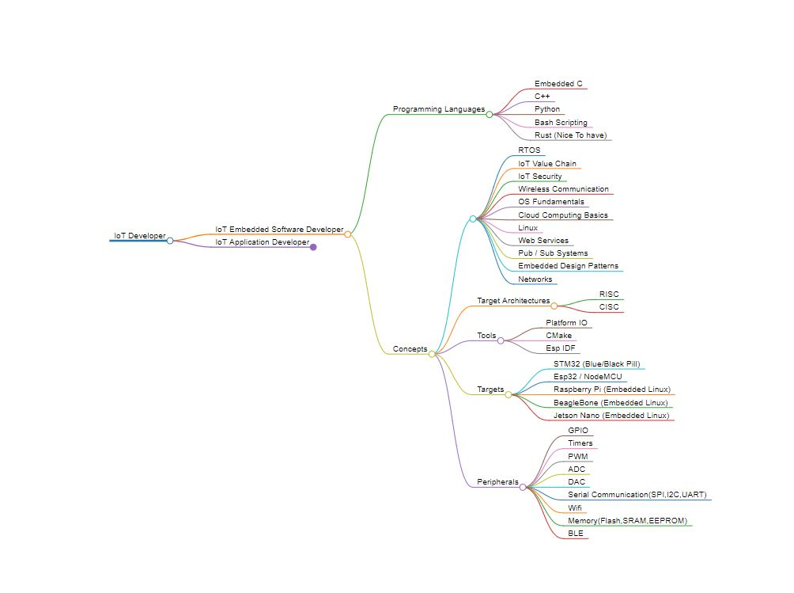

# Caminho para se tornar um desenvolvedor IoT: ✔️

 Este Roadmap está dividido em dois caminhos:

- Desenvolvedor IoT de Embarcados 🧑‍💻
- Desenvolvedor de Aplicações de IoT🧑‍💻

Os roadmaps estão estruturados da seguinte forma:
- Linguagens de Programação
- Conceitos
- Ferramentas

## Desenvolvedor de IoT Embarcado

### Linguagens de Programação 💻:

- C Embarcado (Obrigatório)
- C++ (Obrigatório)
- Python (Obrigatório)
- Scripting em Bash (Bom ter)
- Rust (Bom ter)

Essas linguagens de programação vão te dar um bom ponto de partida para começar a jornada embarcada, onde C++ e C Embarcado são o mínimo necessário para começar.

#### Conceitos 🧠:

- RTOS (Obrigatório)
- Cadeia de Valor de IoT (Obrigatório)
- Segurança em IoT (Bom ter)
- Comunicação Sem Fio (Obrigatório)
- Fundamentos de Sistemas Operacionais (Obrigatório)
- Noções Básicas de Computação em Nuvem (Bom ter)
- Linux (Obrigatório)
- Serviços da Web (Bom ter)
- Sistemas de Pub/Sub (Obrigatório)
- Padrões de Design Embarcados (Obrigatório)
- Redes (Bom ter)

Esses conceitos são essenciais para trabalhar confortavelmente no desenvolvimento de soluções IoT.

### Ferramentas 🧰:

- Platform IO
- CMake
- Esp IDF

### Arquiteturas Alvo

- RISC
- CISC

A diferença entre as arquiteturas CISC e RISC deve ser compreendida durante o desenvolvimento de soluções IoT embarcadas.

Você pode experimentar os seguintes alvos/placas de desenvolvimento:

#### Alvos

- STM32 (Blue/Black Pill)
- Esp32 / NodeMCU
- Raspberry Pi (Linux Embarcado)
- BeagleBone (Linux Embarcado)
- Jetson Nano (Linux Embarcado)

Para trabalhar com esses alvos e obter algo útil deles, é necessário entender os periféricos do alvo, que incluem:

#### Periféricos do Microcontrolador 🎮

- GPIO
- Timers
- PWM
- ADC
- DAC
- Comunicação Serial (SPI, I2C, UART)
- Wifi
- Memória (Flash, SRAM, EEPROM)
- BLE

### Mapa Mental de Alto Nível 🗺️:

## Desenvolvedor de Aplicações IoT

Para se tornar um desenvolvedor de aplicações IoT, você precisa fazer diversos papéis e ter conhecimento em muitas coisas. Você não deve pensar que precisa ser especialista em tudo, mas pelo menos ter uma ideia de como trabalhar com o seguinte:

- Frontend
- Backend
- Desenvolvimento Mobile Multiplataforma (Bom ter)

Você pode escolher entre os seguintes frameworks, dependendo do que você se sentir confortável em trabalhar ou já ter trabalhado antes.

### Linguagens de Programação 💻:

- TypeScript
- JavaScript
- Python
- Java

### Frameworks

#### Frontend

- React
- Angular
- Vue
- Svelte

#### Backend

- ExpressJS
- NestJS
- FastAPI
- Flask
- Django
- SpringBoot
- GO

#### Tecnologias Móveis

- Flutter
- React Native

### Conceitos 🧠

- Cadeia de Valor de IoT
- Segurança em IoT
- Comunicação Sem Fio
- Fundamentos de Sistemas Operacionais
- Noções Básicas de Computação em Nuvem
- Linux
- Serviços da Web
- Sistemas de Publicação/Assinatura
- Integração de Sistemas
- Redes
- M2M (Máquina a Máquina)
- Padrões de Design

Para Sistemas Operacionais de Tempo Real, você só precisa entender como eles funcionam e como lidar com loops de eventos, pois você pode trabalhar com um.

### RTOS (Sistemas Operacionais de Tempo Real)

- Mynewt
- FreeRTOS
- Amazon FreeRTOS
- NuttX
Para os Protocolos da Internet, é obrigatório que você entenda como eles funcionam com diferentes arquiteturas, como cliente/servidor ou sistemas de pub/sub.

### Protocolos da Internet

- HTTP/HTTPS
- MQTT
- COAP
- AMQP

### Tecnologias Sem Fio

- LORA
- BLE
- WIFI
- NFC

Os protocolos industriais não são obrigatórios, mas é bom tê-los e entender como funcionam. Se você quiser trabalhar no espaço IIOT, eles se tornarão muito importantes e fornecerão uma vantagem inicial.

### Protocolos Industriais

- OPC UA
- Modbus

### Computação Distribuída

Você deve pelo menos conhecer um dos seguintes corretores de mensagens para implementar a computação distribuída e a execução de código assíncrono.

- Microservices

##### Corretores de Mensagens

- Kafka
- RabbitMQ
- HiveMQ
- EMQX
- ESB, por exemplo, WSO2

Você precisa conhecer pelo menos um banco de dados relacional, um banco de dados NoSQL e um banco de dados de Timeseries, bem como bancos de dados de chaves.

### Bancos de Dados

- Mysql
- Postgresql
- MongoDB
- Cassandra
- Redis Cache
- InfluxDB

O tempo de comercialização é realmente importante para as empresas, é por isso que usam Plataformas de Habilitação de Aplicações, onde podem desenvolver soluções IoT mais rapidamente. Abaixo estão as mais populares no mercado, variando de soluções de código aberto a soluções totalmente pagas.

### Plataformas IoT (AEP)

- ThingsBoard
- The Things Industries
- Mainflux
- ThingsWorx
- Losant
- ThingsWorks
- Cumulocity
- Data Cake

### Tecnologias e Ferramentas Nativas em Nuvem 🧰

- Kubernetes
- Docker
- Prometheus

#### Monitoramento 🖥️

Monitorar seus ativos, aplicativos e servidores é fundamental para a implantação e manutenção bem-sucedidas de IoT. Grafana é uma das melhores ferramentas de monitoramento e visualização.

- Grafana

### Provedores de Nuvem IoT

Existem dois tipos de AEPs: chamamos de _Plataforma de Habilitação de Aplicações_ e _Hiperscalers_. Amazon e Microsoft são considerados como Hiperscalers de Mercado que entram no espaço de nuvem e IoT para fornecer serviços prontos para acelerar seu tempo de comercialização e ciclo de desenvolvimento.

- AWS IoT
- Azure IoT

### Aqui está um Mapa Mental de Alto Nível 🗺️:

